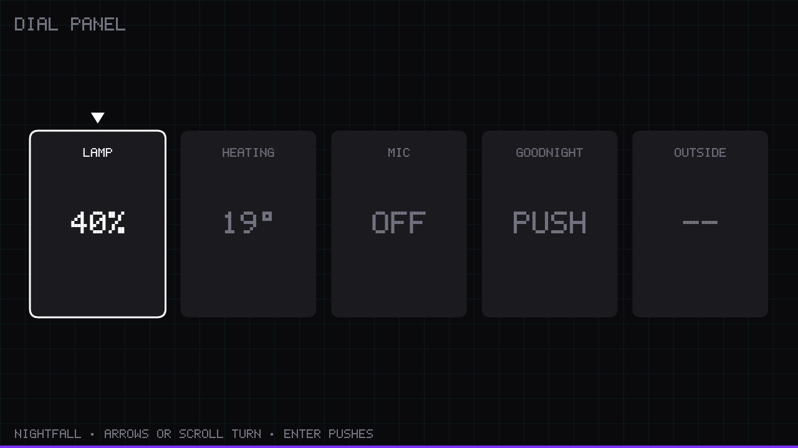
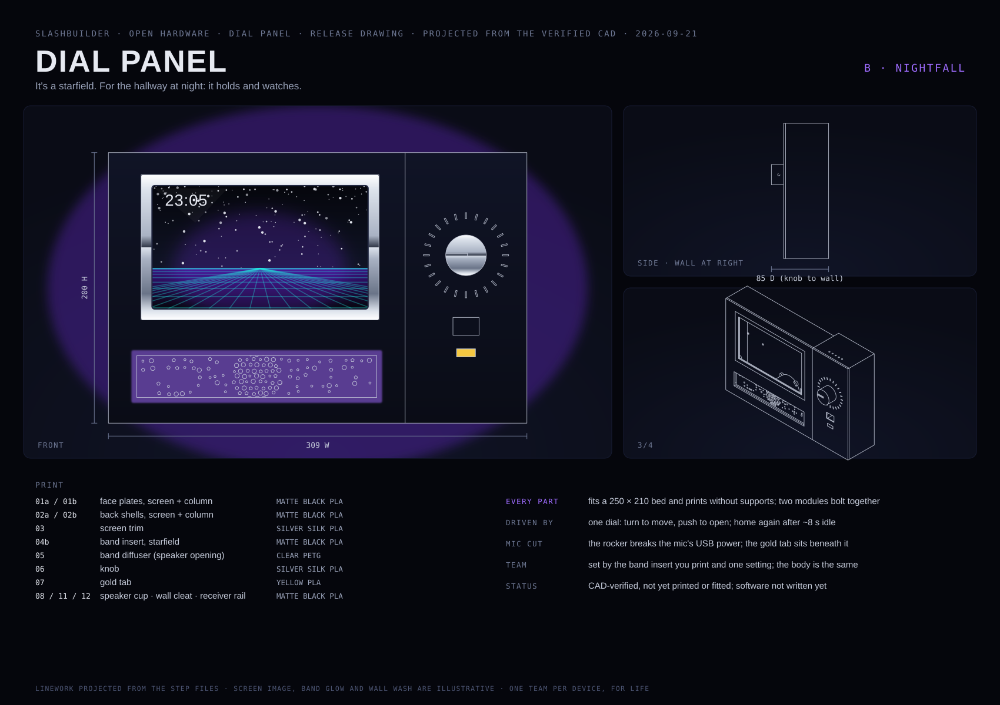

# Dial Panel · hw-2015

An open hardware device from [SlashBuilder](https://github.com/slash-builder). One device, one repo.

A wall-mounted smart-home panel you print yourself and drive with one dial.
Turn to move, push to open, and it goes back home on its own after a few
seconds. No back button, no smudged glass. A hardware switch cuts the
microphone's power.

> **Status: BETA — not ready for full use.** This repo is public so people can
> look it over and send first-pass feedback, not because the design is done.
> It is well into its test-print cycle: all nine plates have been printed at
> least once, the screen module fits together, and the fit coupons passed — but
> **six plates are pending a reprint**, a full fitting is deliberately deferred
> until they come off the bed, and the dashboard software isn't written.
> Expect dimensions, parts and docs to change.
> [`docs/print-log.md`](docs/print-log.md) is the honest record of what has
> been printed, what failed and why. **Fit reports are the most useful
> contribution this project can get right now.**
>
> It is not published to the print marketplaces, and won't be until there is a
> fully working unit.
>
> The panel's **interaction model** — turn, push, adjust, and the idle reset —
> is written and tested, and you can drive it on a laptop today: see
> [`software/`](software/). The dashboard that uses it is still to come.





## Pick a team

One release, two looks. Choose once when you build; a Dial Panel keeps its
team for life. The body, trim, dial and gold tab are identical in both;
only the light changes.

| | **A · IGNITION** | **B · NIGHTFALL** |
|---|---|---|
| It's… | a sunrise | a starfield |
| Print | `stl/ignition/04a-band-insert-ignition.stl` | `stl/nightfall/04b-band-insert-nightfall.stl` |
| Light | warm torch | violet, with a cyan grid |

Drawings: [Ignition](docs/drawings/dial-panel-ignition.svg) ·
[Nightfall](docs/drawings/dial-panel-nightfall.svg). More in
[docs/teams.md](docs/teams.md).

## What you need

**Electronics: one Amazon cart.** [`bom/bom.csv`](bom/bom.csv) lists every
part with a checked listing, pack size and per-build cost: a Raspberry Pi 5,
the official 7" Touch Display 2, a KY-040 push dial, a KCD1 rocker, a
MAX98357A amp, a 40 mm speaker, a USB mini mic and WS2812B LEDs.
Roughly **$320 per build** (≈ $450 cart, with spare parts from multi-packs),
prices as of 2026-09-21. Buying the Pi and display from an approved reseller
is cheaper; the BOM notes where.

**Shopping list:** one row per Amazon listing, with how many to add to your cart.
It's generated from [`bom/bom.csv`](bom/bom.csv). The four filaments are included,
so skip any you already own. The Pi kit already includes the power supply and
cooler. Links carry **no affiliate tag**.

<!-- SHOPPING-LIST:BEGIN -->
| Part | Buy | Per build | Listing |
|---|---|---|---|
| Raspberry Pi 5 (4 GB) | 1 | $158.64 | [Amazon](https://www.amazon.com/dp/B0G4R8TSLN) |
| Raspberry Pi Touch Display 2 (7 in) | 1 | $90.00 | [Amazon](https://www.amazon.com/dp/B0DM24QFCF) |
| microSD card | 1 | $23.99 | [Amazon](https://www.amazon.com/dp/B0B7NXBM6P) |
| KY-040 rotary encoder module | 1 | $1.80 | [Amazon](https://www.amazon.com/dp/B07F26CT6B) |
| Mini rocker switch | 1 | $1.09 | [Amazon](https://www.amazon.com/dp/B08683RMVY) |
| I2S amplifier | 1 | $3.44 | [Amazon](https://www.amazon.com/dp/B0DPJRLMDJ) |
| Speaker | 1 | $4.50 | [Amazon](https://www.amazon.com/dp/B01LN8ONG4) |
| USB microphone | 1 | $7.99 | [Amazon](https://www.amazon.com/dp/B01KLRBHGM) |
| USB-A extension (to splice) | 1 | $3.00 | [Amazon](https://www.amazon.com/dp/B0CDC3KQN1) |
| WS2812B LED strip | 2 | $7.79 | [Amazon](https://www.amazon.com/dp/B01CDTED80) |
| Level shifter (recommended) | 1 | $7.25 | [Amazon](https://www.amazon.com/dp/B00XW2L39K) |
| M3 heat-set inserts | 1 | $0.60 | [Amazon](https://www.amazon.com/dp/B0DDWS7BTS) |
| M3 socket-head screws | 1 | $0.50 | [Amazon](https://www.amazon.com/dp/B0GRV5NW7Q) |
| Dupont jumper wires | 1 | $0.90 | [Amazon](https://www.amazon.com/dp/B01EV70C78) |
| Heat-shrink assortment | 1 | $0.25 | [Amazon](https://www.amazon.com/dp/B01MFA3OFA) |
| Filament: matte black PLA | 1 | $8.50 | [Amazon](https://www.amazon.com/dp/B0D7ZYCVTY) |
| Filament: silver silk PLA | 1 | $1.30 | [Amazon](https://www.amazon.com/dp/B0C6QFDQWT) |
| Filament: yellow/gold PLA | 1 | $0.70 | [Amazon](https://www.amazon.com/dp/B0B12W69HT) |
| Filament: clear/natural PETG | 1 | $0.85 | [Amazon](https://www.amazon.com/dp/B085TGGV3L) |
<!-- SHOPPING-LIST:END -->

Wall screws and anchors come from any hardware store. Regenerate this list with
`python3 bom/shopping_list.py` whenever the BOM changes.

**A printer** with a 250 × 210 mm bed or larger (Prusa MK4, Bambu A1, and
similar). Every part prints **without supports**.

**Filament:** matte black PLA (~500 g), silver silk PLA (~75 g), yellow PLA
(a few grams) and clear PETG (~40 g).

**Tools:** a soldering iron (heat-set inserts, amp headers, one wire splice),
a 2.5 mm hex key, and wire strippers.

## What you print

| File | Part | Material | Qty |
|---|---|---|---|
| 01a, 01b | face plates: screen, column | matte black PLA | 1 each |
| 02a, 02b | back shells: screen, column | matte black PLA | 1 each |
| 03 | screen trim | silver silk PLA | 1 |
| 04a **or** 04b | band insert: ember **or** starfield | matte black PLA | 1 |
| 05 | band diffuser (with speaker opening) | clear PETG | 1 |
| 06 | knob | silver silk PLA | 1 |
| 07 | gold tab | yellow PLA | 1 |
| 08 | speaker back-cup | matte black PLA | 1 |
| 11 | wall cleat | matte black PLA | 1 |
| 12 | cleat receiver rail (bolts to the back shell) | matte black PLA | 1 |

Every STL is already in its print orientation and prints without supports.

The panel is two modules (screen and control column) that bolt together:
the 7" screen plus the dial is wider than any common print bed.
Assembled it's **309 × 200 mm and 67 mm off the wall** (85 mm to the knob).

## Printing on a Bambu Lab printer

Open **[`bambu/dial-panel-hw-2015.3mf`](bambu/dial-panel-hw-2015.3mf)** in Bambu Studio. Every
part is already placed, oriented and assigned its filament, on named plates:

| Plate | Parts | Filament | Time (A1) |
|---|---|---|---|
| 1 | face plate, screen | matte black PLA | 1 h 33 m |
| 2 | back shell, screen | matte black PLA | 4 h 31 m |
| 3 | control column: face plate + back shell | matte black PLA | 4 h 30 m |
| 4 | speaker cup, wall cleat, receiver rail | matte black PLA | 39 m |
| 5 | screen trim + knob | silver silk PLA | 37 m |
| 6 | gold tab | yellow PLA | 1 m |
| 7 | band diffuser | clear PETG | 11 m |
| 8 | **A · IGNITION** band insert | matte black PLA | 44 m |
| 9 | **B · NIGHTFALL** band insert | matte black PLA | 39 m |

Print **plates 1–7**, plus **either 8 or 9** for your team: about 12½ hours in
total. The project is set up for the **A1 with a 0.4 mm nozzle** on the
**Textured PEI plate**. On another Bambu printer, switch the printer in Bambu
Studio and re-slice. For other slicers, use the STLs in `stl/`.

## Build

1. **Print** the parts above: the Bambu project, or the STLs, which are already print-oriented.
2. **Inserts:** heat-set the M3 inserts. Every screw goes in from the back, so the face stays clean.
3. **Screen module:** fit the display, with the Pi 5 and cooler on its back, the amp and the speaker (back-cup screwed on behind it).
4. **Column:** fit the dial (held by its own nut), the rocker, the gold tab and the mic cradle.
5. **Wire it:** follow [`docs/wiring.md`](docs/wiring.md) — a pin map, a diagram per subsystem, and the one-wire mic-cut splice. Then append [`docs/config.txt`](docs/config.txt) to the Pi's `/boot/firmware/config.txt`.
6. **Close up:** fit your team's band insert and the diffuser, lay in the LED strips, screw the face plates on, and bolt the two modules together.
7. **Hang it:** screw the cleat to the wall and drop the panel onto it.

**Full step-by-step with a drawing for each step:** [`docs/assembly.md`](docs/assembly.md).

## How it's checked

The CAD in `cad/` is parametric FreeCAD and regenerates every file. Every run checks:

- **Every part:** one clean solid that fits the bed.
- **Openings:** every opening exists (31/31), and there are no unintended ones.
- **Fit:** nothing collides in the assembled position (27/27 part pairs). That
  includes Raspberry Pi's own display model and every screw's full length.
- **Sound:** the path from the speaker through the band stays at least 25% open,
  for both inserts.
- **Hanging:** the wall cleat engages 16.8 mm, and the panel hangs flat against the wall.
- **Printing:** every part sits flat in its print orientation, and every plate slices in Bambu Studio with support off and no warnings.

To regenerate, download Raspberry Pi's Touch Display 2 STEP into
`cad/vendor/` (see `cad/vendor/README.txt`; it's their file, so it isn't
included here) and run
`freecadcmd cad/generate_parts.py`. Then `python3 bambu/build_project.py`
rebuilds the Bambu project and the print-oriented STLs, and slices every plate
as a check. It needs FreeCAD and Bambu Studio installed.

## Known limits

- **Silver silk isn't chrome.** It reads metallic, not mirror.
- **The gold tab is fixed in place** rather than revealed only when the mic is live. The rocker's position shows the mic state.
- **Unconfirmed part dimensions:** a few sizes come from listings and are marked in `cad/README.md`. They include the dial's shaft flat, the rocker's clip thickness and the speaker's depth. Measure your parts; each is a single parameter.
- **LED brightness is capped at about 25%.** Full brightness would pull more current than the Pi's 5 V pins can supply.

## Versions

Every commit on `main` is tagged `vMAJOR.MINOR.PATCH` automatically, patch
counting up. **A tag is a specific printable state of the hardware** — the
CAD, the STLs, the slicer project and the docs as they were together — so if
you print something, note the tag and you can always get back to exactly that
geometry.

This matters more here than in a software repo: a fix can change a part's
dimensions, and a part printed from an older tag may no longer fit one printed
from a newer one. [`docs/print-log.md`](docs/print-log.md) records which parts
changed at each step and what needs reprinting.

Patch bumps happen on their own. Minor and major are deliberate: push a tag
like `v0.2.0` by hand when a release means something, and the automation picks
up from there.

## Repository layout

```
bom/bom.csv          every part, with a checked Amazon listing
cad/                 parametric FreeCAD source + STEP exports + verification notes
cad/vendor/          where Raspberry Pi's display STEP goes (not included)
stl/common/          parts every build prints
stl/ignition/        the A · IGNITION band insert
stl/nightfall/       the B · NIGHTFALL band insert
bambu/               the Bambu Studio project (9 named plates) and the script that builds it
docs/                wiring, config.txt, choosing a team, release drawings
```

## Contributing

Real print reports are the most useful thing you can send: see
[`docs/print-log.md`](docs/print-log.md) for what has been printed so far and
what to check.


Issues and pull requests are welcome, especially fit reports from real
prints (printer, filament, what fit and what didn't). Geometry changes go in
`cad/generate_parts.py`, then regenerate. A change isn't done until every
check in the run still passes.

## License

Code (`cad/generate_parts.py`, `docs/drawings/*.py`) is **Apache-2.0**. Design
files (CAD, STL, drawings, BOM, docs) are **CC-BY-4.0**. See
[LICENSE](LICENSE). Raspberry Pi's display model is theirs and isn't
included.
