# Assembly

About two hours, once everything is printed. No glue anywhere: heat-set
inserts and M3 screws, plus one soldered splice for the mic cut.

Every screw goes in from the back or from inside, so the finished front has
no visible fastener.

> The drawings are generated from the CAD, so they match the parts exactly.
> Each one states its viewpoint, e.g. *front-right 3/4*. Regenerate them with
> `python3 docs/assembly/build_steps.py`.

## Before you start

**Printed** (see [print settings](../README.md#printing-on-a-bambu-lab-printer)): all of `stl/common/`, plus one band insert —
`stl/ignition/` **or** `stl/nightfall/`.

**Bought:** everything in [`bom/bom.csv`](../bom/bom.csv).

**Tools:** soldering iron with a heat-set insert tip (or a flat tip), 2.5 mm
hex key, small Phillips screwdriver, wire strippers, side cutters.

**Fasteners used**

| Where | Size | Count |
|---|---|---|
| Face plate → back shell (screen) | M3 × 12 | 6 |
| Face plate → back shell (column) | M3 × 12 | 4 |
| Seam, screen module → column | M3 × 16 | 4 |
| Display → back shell | M2.5 (supplied with the display) | 4 |
| Speaker back-cup | M3 × 8 | 4 |
| Trim ring | M3 × 8 | 4 |
| Band insert + diffuser | M3 × 8 | 4 |
| Cleat receiver rail | M3 × 8 | 3 |
| Wall cleat → wall | #8 wood screws + anchors | 2 |

---

## 1 · Heat-set the inserts

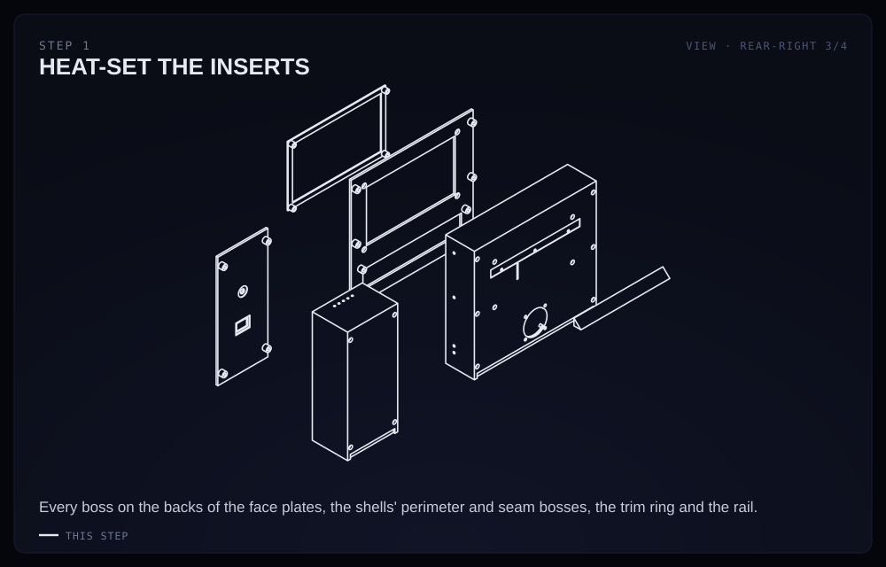

Melt an M3 insert into every boss marked here: the back of both face plates
(01a, 01b), the perimeter and seam bosses of both back shells (02a, 02b), the
trim ring (03), and the receiver rail (12).

Set the iron to about 240 °C, press each insert in square, and stop when its
top is flush. Let them cool before you screw into them. **Take your time
here:** a crooked insert is the most common way one of these builds goes
wrong.

## 2 · Fit the receiver rail to the back shell

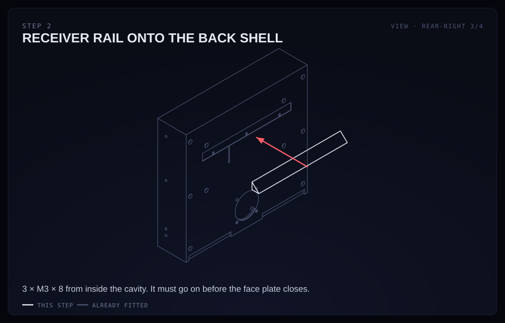

The rail (12) is what the panel later hangs on. It goes on **now**, because
its screws are driven from inside the cavity, which closes in step 9.

Sit the rail in the shallow recess on 02a's back wall — the recess locates it,
so there's nothing to measure — and drive 3 × M3 × 8 from inside the cavity.

## 3 · Mount the display and the Pi

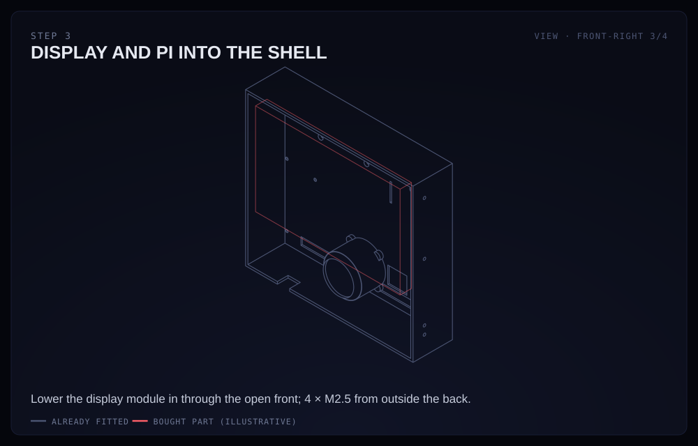

With the Pi 5 and its Active Cooler already bolted to the back of the Touch
Display 2, lower the whole module into 02a through the open front.

Drive 4 × M2.5 (the display's own screws) from **outside** the back wall into
the display's mounting holes. Route the display's power leads and the FPC
cable clear of the speaker pod.

## 4 · Speaker, amp, level shifter

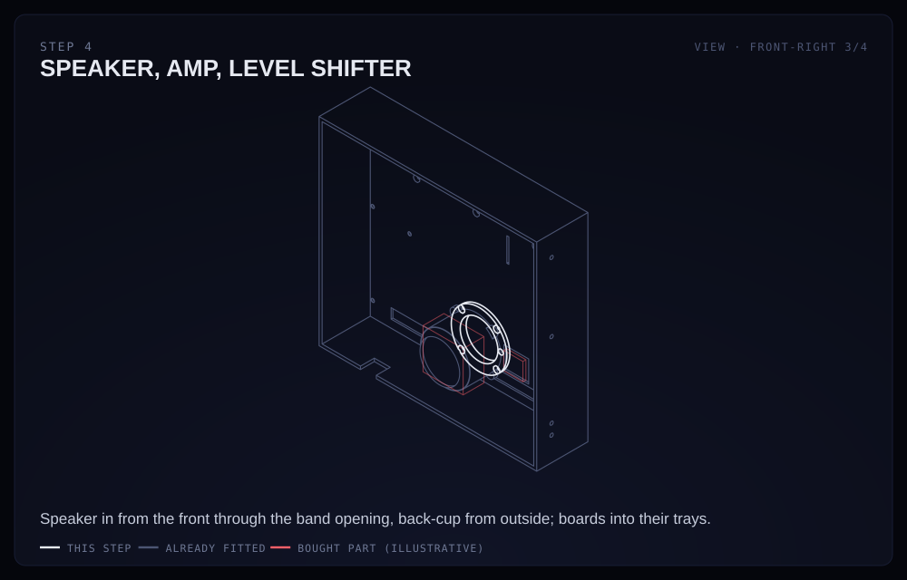

Press the 40 mm speaker into the pod shoulder from the **front**, through the
band opening — it won't fit once the band insert is on. Screw the back-cup
(08) on from outside the back wall, 4 × M3 × 8. That seals the speaker's
chamber, so seat it evenly.

Drop the MAX98357A amp and, if you're using it, the 74AHCT125 level shifter
into their trays. They're friction fits; don't force them.

## 5 · LED strips

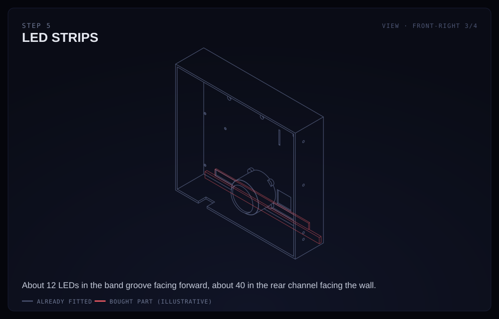

Two runs, both on 02a:
- **Band:** about 12 LEDs in the groove behind the band window, facing forward.
- **Wall wash:** about 40 LEDs in the channel around the rear perimeter, facing the wall.

Cut only on the marked copper pads. Feed both sets of leads toward the Pi.

## 6 · Microphone and the mic cut

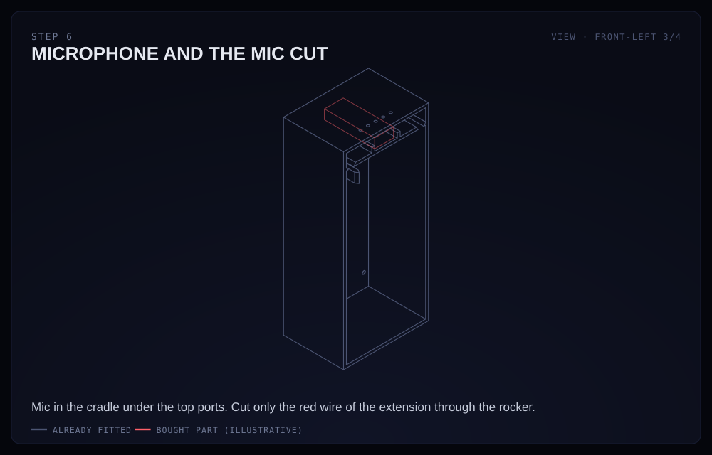

Sit the USB mic dongle in the cradle inside 02b, facing the row of ports along
the top edge.

Then wire the mic cut, which is the one bit of soldering:
cut **only the red wire** of the USB extension, solder both ends to the
rocker's two terminals, and insulate each joint with heat-shrink. Off then
physically removes the microphone's power. Full detail in
[wiring.md](wiring.md).

## 7 · Wire it up

No drawing for this one — follow [wiring.md](wiring.md) pin by pin, then
append [config.txt](config.txt) to `/boot/firmware/config.txt` on the Pi's
card.

**Power up and test before you close anything:** the screen should light, the
dial should move the focus, pressing it should select, and the speaker should
play. It is much easier to fix now than after the panels are on.

## 8 · Dress the face plate

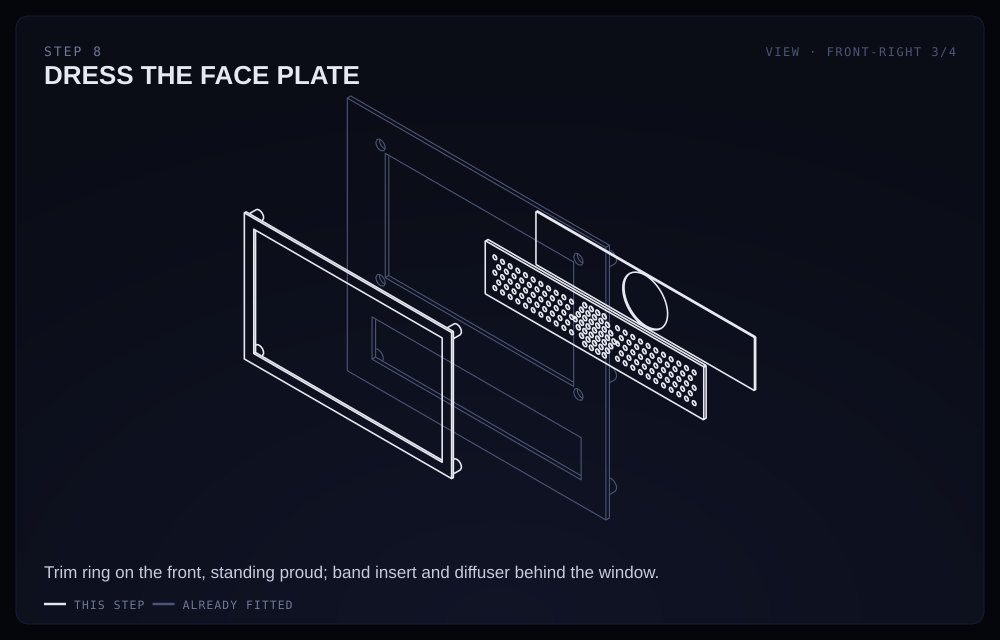

On 01a:
- **Trim ring (03):** sits on the front face, standing about 1.5 mm proud, and screws from behind, 4 × M3 × 8.
- **Band insert** (your team's) and **diffuser (05)**: stack them behind the band window and screw both into the same bosses, 4 × M3 × 8. The diffuser's hole goes over the speaker.

## 9 · Close the screen module

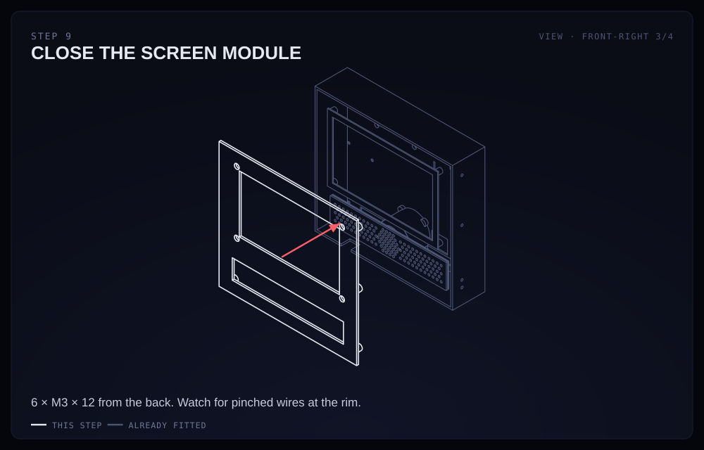

Lower 01a onto 02a, watching that no wires are pinched at the rim. Drive
6 × M3 × 12 from the **back**, through the shell into the face plate's bosses.

## 10 · Build the control column

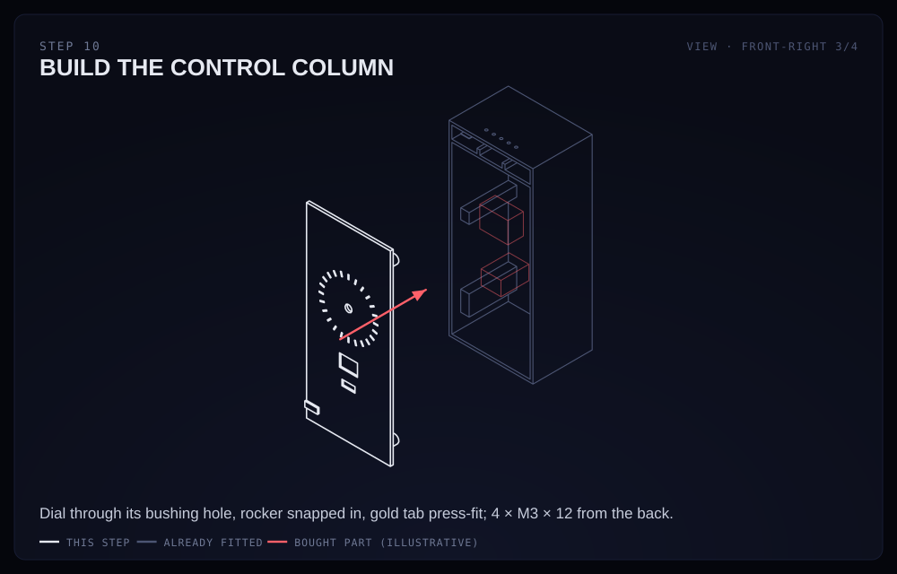

On 01b, from the front:
- **Dial (KY-040):** through the bushing hole, held by its own M7 nut.
- **Rocker:** snaps into its cutout.
- **Gold tab (07):** press-fits into its pocket under the rocker.

Then close 01b onto 02b with 4 × M3 × 12 from the back.

## 11 · Join the two modules

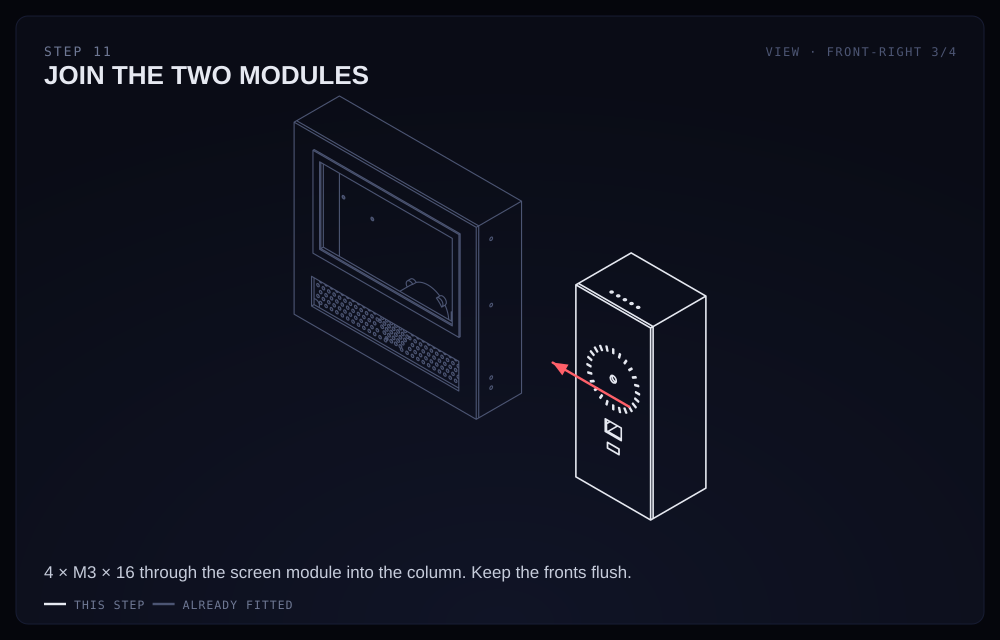

Stand the screen module and the column face to face, so their side walls
meet, and drive 4 × M3 × 16 through 02a into the column's bosses. Keep the
front faces flush as you tighten.

## 12 · Knob

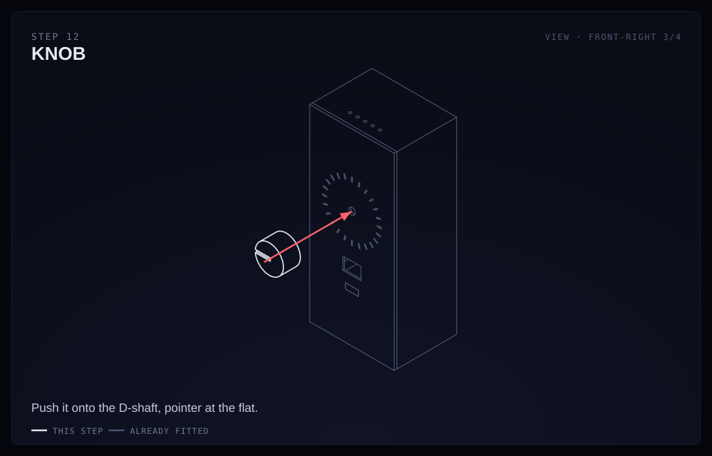

Push the knob onto the encoder's D-shaft, with the pointer at the flat.
It should need a firm push. If it's loose, a drop of the M3 set screw in its
radial pilot hole holds it.

## 13 · Hang it

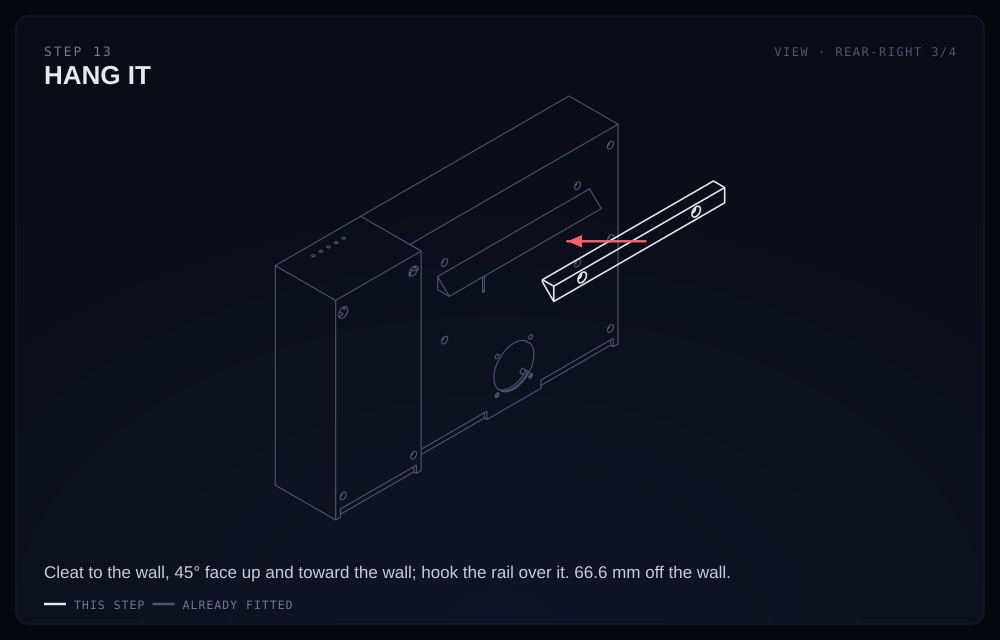

Screw the wall cleat (11) to the wall — into a stud if you can, otherwise
drywall anchors — with its 45° face pointing **up and toward the wall**.
Check it's level.

Hook the panel's rail over it and let go. The weight wedges the two 45° faces
together, and the panel sits 66.6 mm off the wall. Route the USB-C power
cable out of the slot in the bottom edge.

---

## If something doesn't fit

The rocker cutout, the dial's shaft flat and the speaker's depth all came from
listing photos rather than datasheets, so they are the likeliest to need a
tweak. Each is a single named value in `cad/generate_parts.py`; change it and
regenerate. Please also report it in
[print-log.md](print-log.md) so the next builder doesn't hit it.
