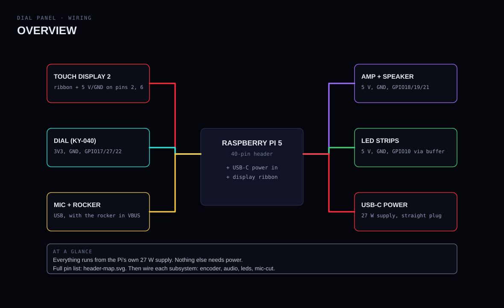
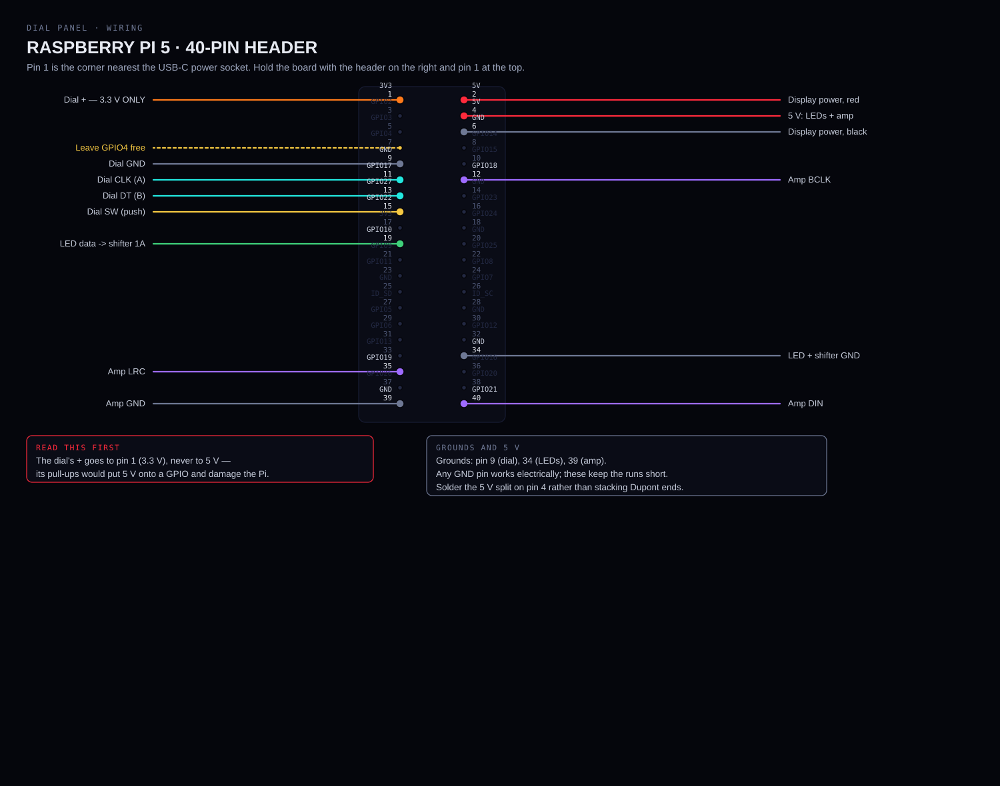
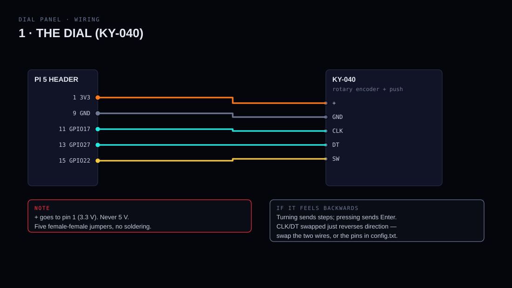
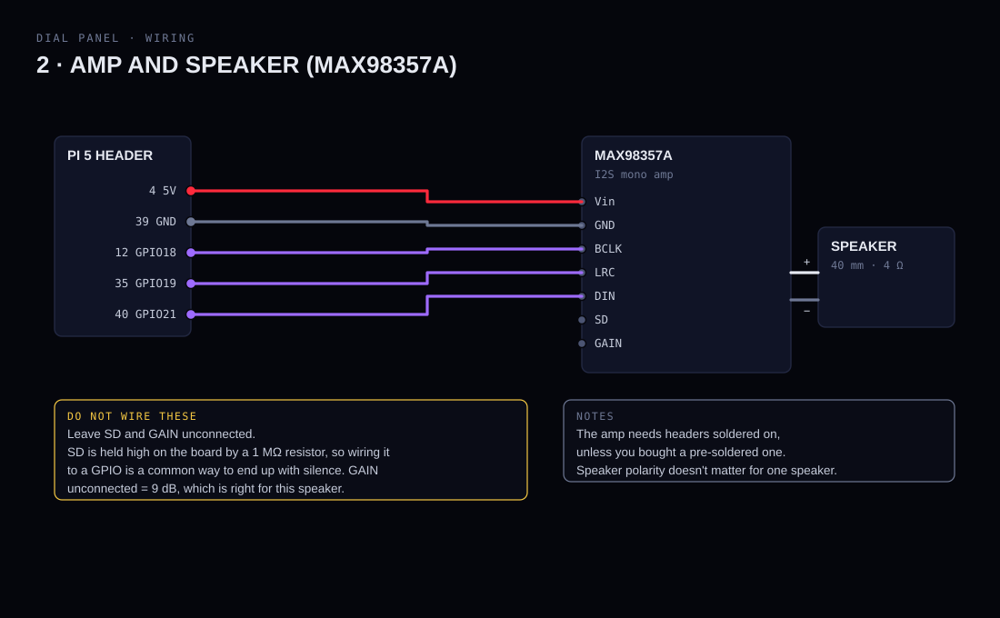
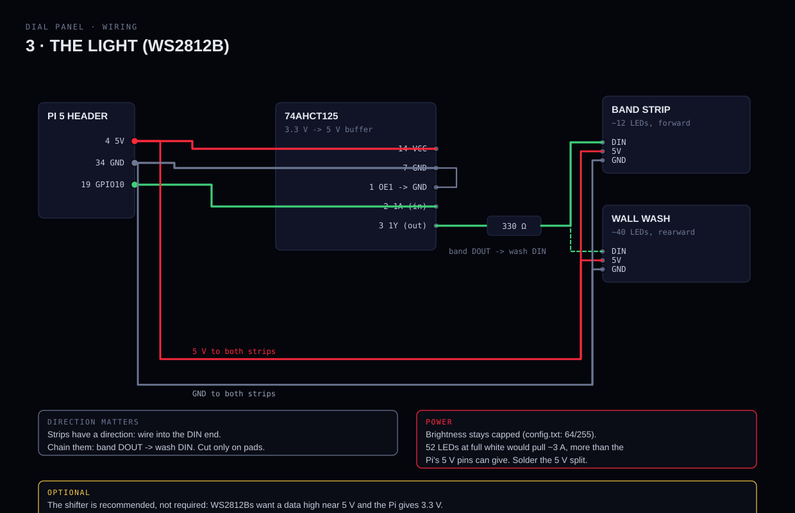
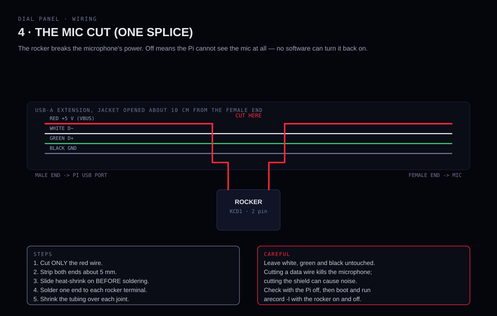

# Wiring

Everything plugs into the Raspberry Pi 5. There are **15 jumper wires, one
soldered splice, and (optionally) one small chip on a scrap of perfboard**.

If you have never wired a Pi before, this page is written for you: do the
sections in order, and test after each one.

---

## Before you touch a wire

1. **Unplug the Pi.** Never move a jumper with power on.
2. **Know where pin 1 is.** It's the corner nearest the USB-C power socket.
   Hold the board with the header on the right and pin 1 at the top, exactly
   as in the map below. **Counting from the wrong end is the most common
   mistake, and on pin 1 it means 5 V into a GPIO.**
3. **Pins are counted in pairs:** odd numbers down the left column, even
   numbers down the right. 1 and 2 are side by side.

### Wire colours

Not required, but the diagrams use them and it makes a photo readable:

| Colour | Means |
|---|---|
| Red | 5 V |
| Orange | 3.3 V |
| Black / grey | ground |
| Cyan, violet, green, yellow | signals |

---

## 1 · The dial

Five female-to-female jumpers, no soldering.

| KY-040 pad | Pi pin | Pi name | Colour |
|---|---|---|---|
| `+` | **1** | 3V3 | orange |
| `GND` | **9** | GND | black |
| `CLK` | **11** | GPIO17 | cyan |
| `DT` | **13** | GPIO27 | cyan |
| `SW` | **15** | GPIO22 | yellow |

> **`+` goes to pin 1 (3.3 V), never to 5 V.** The module's pull-up resistors
> would then put 5 V onto a GPIO, which can damage the Pi. GPIOs are 3.3 V only.

**Test** (after adding `config.txt`, below): `sudo apt install evtest`, run
`evtest`, choose the `rotary` device, and turn the dial. You should see
`REL_X` events, one per click. Choose the `dial-push` device and press: you
should see `KEY_ENTER`.

---

## 2 · The amp and speaker

| Amp pad | Pi pin | Pi name | Colour |
|---|---|---|---|
| `Vin` | **4** | 5V | red |
| `GND` | **39** | GND | black |
| `BCLK` | **12** | GPIO18 | violet |
| `LRC` | **35** | GPIO19 | violet |
| `DIN` | **40** | GPIO21 | violet |

The speaker's two tags go to the amp's `+` and `−` screw terminals. With one
speaker, polarity doesn't matter.

> **Leave `SD` and `GAIN` unconnected.** On the Adafruit board (and most
> clones) `SD` is held high by a 1 MΩ resistor to Vin, so the amp is already
> enabled — wiring `SD` to a GPIO is a common way to end up with silence.
> `GAIN` unconnected gives 9 dB, which suits this speaker.
> ([Adafruit pinout](https://learn.adafruit.com/adafruit-max98357-i2s-class-d-mono-amp/pinouts))

Most of these boards ship with loose headers: solder them, or buy one
pre-soldered.

**Test:** `speaker-test -c1 -t sine -f 440 -l1`. You should hear a tone.
`aplay -l` should list a `MAX98357A` card.

---

## 3 · The LEDs

| From | To | Colour |
|---|---|---|
| Pi pin **4** (5V) | both strips' `5V`, amp `Vin`, shifter pin 14 | red |
| Pi pin **34** (GND) | both strips' `GND`, shifter pin 7 | black |
| Pi pin **19** (GPIO10) | shifter pin 2 (`1A`) | green |
| Shifter pin 3 (`1Y`) | 330 Ω resistor → band strip `DIN` | green |
| Band strip `DOUT` | wall-wash strip `DIN` | green |
| Shifter pin 1 (`OE1`) | ground | black |

**Strips have a direction.** The arrows printed on them point away from the
`DIN` end. Wire into `DIN`; cut only on the marked copper pads.

> **Power.** 52 LEDs at full white would draw about 3 A, far more than the
> Pi's 5 V pins should supply. `config.txt` caps brightness at 64 of 255, which
> keeps the worst case near 0.8 A. Keep that cap. Solder the 5 V split rather
> than stacking Dupont ends, and use 22 AWG for this run.

**The level shifter is optional.** WS2812Bs want a data high near 5 V, and the
Pi gives 3.3 V. Many strips work anyway. Try without it (GPIO10 straight to
the resistor); if the LEDs flicker or show wrong colours, add it.

---

## 4 · The mic cut

This is the one soldered joint, and the reason the panel can claim a real
privacy switch: the rocker breaks the microphone's **power**, so when it's off
the Pi cannot see the mic at all.

1. Open the USB extension's jacket about 10 cm from the female end.
2. **Cut only the red wire.** Leave white, green, black and the shield alone.
3. Strip about 5 mm from each cut end.
4. Slide heat-shrink onto the wires **before** soldering.
5. Solder one end to each rocker terminal, then shrink the tubing.

Plug the male end into a Pi USB port and the mic into the female end.

**Test:** `arecord -l` with the rocker on lists a USB audio device; with it off,
the device disappears. Record five seconds: `arecord -d 5 -f cd mic.wav`, then
`aplay mic.wav`.

---

## 5 · Display and power

- **Display ribbon:** the standard-to-mini FPC cable from the display's box,
  into either MIPI connector on the Pi.
- **Display power:** the supplied lead to pins **2** (5 V, red) and **6**
  (GND, black).
- **Pi power:** the 27 W USB-C supply, into the Pi, out through the slot in
  the bottom edge. Use the straight plug, not a right-angle adapter: an
  adapter can drop the Pi out of its 5 A power mode.

---

## 6 · Configuration

Append [`config.txt`](config.txt) to `/boot/firmware/config.txt`, then reboot.
It loads four stock drivers: the amp, the dial's rotation, the dial's push,
and the LEDs. No custom drivers, nothing to compile.

One line may need changing: if your encoder has 30 detents instead of 20,
change `steps-per-period=1` to `2`.

---

## If something doesn't work

| Symptom | Most likely cause |
|---|---|
| Nothing at all, Pi won't boot | Power. Use the 27 W supply and the straight plug. |
| Screen dark, Pi running | Ribbon in the wrong way round, or display power not on pins 2 and 6. |
| No sound, `aplay -l` shows no card | `dtoverlay=max98357a,no-sdmode` missing, or BCLK/LRC/DIN on the wrong pins. |
| No sound, card is listed | Speaker wires loose, or volume muted (`alsamixer`). |
| Dial turns the wrong way | Swap `CLK` and `DT`, or swap the pins in `config.txt`. |
| Dial skips or double-steps | Wrong `steps-per-period` for your encoder. |
| Dial does nothing | `+` on the wrong pin, or GND missing. |
| Push does nothing, turning works | `SW` not on pin 15. |
| Mic never appears | The red wire isn't joined through the rocker, or a data wire was cut. |
| LEDs dead | Wired into `DOUT` instead of `DIN`, or no shared ground. |
| LEDs flicker or wrong colours | Add the level shifter; check the 330 Ω resistor. |
| First few LEDs work, rest don't | Brightness too high for the 5 V rail, or a bad joint mid-strip. |

Found something this table doesn't cover? Please add it, or open an issue —
see [print-log.md](print-log.md).

---

## Where these numbers come from

- Pi 40-pin header: the standard Raspberry Pi pinout (Pi 5 keeps it).
- `max98357a`, `rotary-encoder`, `gpio-key`, `ws2812-pio`: the overlay README
  in `raspberrypi/firmware`.
- Amp `SD`/`GAIN` behaviour: Adafruit's MAX98357A pinout page (linked above).
- Everything else: `bom/bom.csv`, which lists the exact part each pin assumes.

The diagrams are generated by `docs/wiring/build_diagrams.py`.
